# Multi-Agent Writing Analysis System

## Overview

The Writing Assistant employs a sophisticated 8-agent system that provides comprehensive feedback on written content. Each agent specializes in different aspects of writing analysis, working together to deliver holistic insights while maintaining efficiency and accuracy.

## System Architecture

```mermaid
graph TB
    User[👤 User Writing] --> Interface[🖥️ Writing Interface]
    Interface --> Orchestrator[🎯 Agent Orchestrator]
    
    Orchestrator --> BaseAgent[⚙️ Base Agent<br/>Model Selection & Context Management]
    
    BaseAgent --> FastAgents[🚀 Fast Response Agents<br/>gpt-4o-mini]
    BaseAgent --> StandardAgents[🎯 Standard Agents<br/>gpt-4o]
    BaseAgent --> PremiumAgents[💎 Premium Agents<br/>gpt-4]
    
    FastAgents --> ClarityAgent[📝 Clarity & Style Agent]
    FastAgents --> QuickFact[⚡ Quick Fact Checker]
    
    StandardAgents --> IntellectualCritic[🧠 Intellectual Critic]
    StandardAgents --> EvidenceAgent[📊 Evidence Quality Agent]
    StandardAgents --> LogicalAgent[🔍 Logical Fallacy Detector]
    StandardAgents --> ContextualAgent[🔎 Contextual Research Critic]
    StandardAgents --> PurposeAgent[🎯 Purpose Fulfillment Agent]
    
    PremiumAgents --> DeepFactAgent[🕵️ Deep Fact Verification Agent]
    
    ClarityAgent --> FeedbackPanel[📋 Feedback Panel]
    IntellectualCritic --> FeedbackPanel
    EvidenceAgent --> FeedbackPanel
    LogicalAgent --> FeedbackPanel
    ContextualAgent --> FeedbackPanel
    PurposeAgent --> FeedbackPanel
    QuickFact --> FeedbackPanel
    DeepFactAgent --> FeedbackPanel
    
    FeedbackPanel --> User
```



## Agent Hierarchy & Capabilities

### Base Agent System


## Individual Agent Specifications

### 1. Clarity & Style Agent 🚀 (Fast Tier)
**Purpose**: Quick grammar, readability, and style analysis
**Model**: gpt-4o-mini
**Response Time**: ~1-2 seconds

```json
{
  "specializes_in": [
    "Grammar errors",
    "Sentence structure", 
    "Readability metrics",
    "Style consistency",
    "Word choice optimization"
  ],
  "avoids": [
    "Factual accuracy",
    "Content analysis",
    "Argument evaluation"
  ],
  "output_format": {
    "type": "clarity_style",
    "includes": ["quickFix", "readabilityImpact", "priority"]
  }
}
```

### 2. Intellectual Critic 🎯 (Standard Tier)
**Purpose**: Deep reasoning and argumentation analysis
**Model**: gpt-4o
**Response Time**: ~3-5 seconds

```json
{
  "specializes_in": [
    "Logical consistency",
    "Argument structure",
    "Evidence integration",
    "Counter-argument consideration",
    "Dialectical opportunities"
  ],
  "features": [
    "Dialectical opportunity detection",
    "Argument mapping",
    "Reasoning pattern analysis"
  ]
}
```

### 3. Evidence Quality Agent 🎯 (Standard Tier)
**Purpose**: Evaluates the strength and relevance of evidence
**Model**: gpt-4o

```json
{
  "specializes_in": [
    "Source credibility assessment",
    "Evidence relevance",
    "Statistical validity",
    "Citation quality",
    "Research methodology"
  ],
  "escalation_triggers": [
    "Complex statistical claims",
    "Academic research validation",
    "Multi-source verification"
  ]
}
```

### 4. Logical Fallacy Detector 🎯 (Standard Tier)
**Purpose**: Identifies logical fallacies and reasoning errors
**Model**: gpt-4o

```json
{
  "detects": [
    "Ad hominem attacks",
    "Straw man arguments", 
    "False dichotomies",
    "Slippery slope fallacies",
    "Appeal to authority",
    "Circular reasoning"
  ],
  "provides": [
    "Fallacy classification",
    "Explanation of error",
    "Correction suggestions"
  ]
}
```

### 5. Quick Fact Checker ⚡ (Fast Tier)
**Purpose**: Rapid fact verification for obvious claims
**Model**: gpt-4o-mini

```json
{
  "checks": [
    "Basic factual claims",
    "Common knowledge verification",
    "Obvious inconsistencies",
    "Date/number accuracy"
  ],
  "escalates_to": "Deep Fact Verification Agent",
  "confidence_threshold": 0.75
}
```

### 6. Deep Fact Verification Agent 💎 (Premium Tier)
**Purpose**: Comprehensive fact-checking for complex claims
**Model**: gpt-4
**Response Time**: ~10-15 seconds

```json
{
  "capabilities": [
    "Multi-source verification",
    "Academic database cross-referencing",
    "Statistical claim validation",
    "Historical accuracy checking",
    "Scientific claim verification"
  ],
  "triggered_by": [
    "Quick Fact Checker escalation",
    "High-stakes claims",
    "Academic writing mode",
    "Research paper analysis"
  ]
}
```

### 7. Contextual Research Critic 🎯 (Standard Tier)
**Purpose**: Suggests additional research and context
**Model**: gpt-4o

```json
{
  "provides": [
    "Research gap identification",
    "Additional source suggestions", 
    "Context expansion opportunities",
    "Field-specific insights",
    "Interdisciplinary connections"
  ]
}
```

### 8. Purpose Fulfillment Agent 🎯 (Standard Tier)
**Purpose**: Evaluates how effectively writing accomplishes its stated purpose
**Model**: gpt-4o
**Response Time**: ~5-7 seconds

```json
{
  "specializes_in": [
    "Strategic writing effectiveness",
    "Purpose-goal alignment analysis",
    "Audience effectiveness assessment",
    "Message impact evaluation",
    "Outcome optimization strategies"
  ],
  "analyzes": [
    "Purpose alignment",
    "Audience effectiveness", 
    "Goal achievement likelihood",
    "Strategic structure",
    "Message clarity and impact",
    "Optimization opportunities"
  ],
  "features": [
    "Intelligent purpose categorization",
    "Audience inference and matching",
    "Strategic impact scoring",
    "Implementation guidance"
  ],
  "output_format": {
    "includes": ["effectivenessScore", "strategicRecommendation", "expectedOutcome", "priorityLevel"]
  }
}
```

## Agent Interaction Flow


## Performance Optimization

### Tier-Based Execution Strategy

```mermaid
graph LR
    Input[User Input] --> Analysis{Content Analysis}
    
    Analysis -->|Simple| FastOnly[Fast Agents Only<br/>⚡ 1-2 seconds<br/>💰 Low cost]
    Analysis -->|Medium| Standard[Standard + Fast<br/>🎯 3-5 seconds<br/>💰 Medium cost] 
    Analysis -->|Complex| Premium[All Tiers<br/>💎 10-15 seconds<br/>💰 High cost]
    
    FastOnly --> Results[Feedback Results]
    Standard --> Results
    Premium --> Results
```



### Smart Escalation Logic

```python
def should_escalate(agent, confidence, task_complexity, error_count):
    return (
        confidence < agent.escalation_threshold or
        task_complexity == 'high' or
        error_count > 0
    )
```

## Prompt Customization System

```mermaid
graph TB
    DefaultPrompts[📋 Default Prompts] --> CustomService[⚙️ Prompt Customization Service]
    UserPrefs[👤 User Preferences] --> CustomService
    
    CustomService --> LocalStorage[💾 Local Storage]
    CustomService --> UserProfile[☁️ User Profile<br/>Firebase]
    
    CustomService --> AgentPrompts[🤖 Agent Prompts]
    
    AgentPrompts --> IntellectualPrompt[🧠 Intellectual Critic<br/>Customizable: tone, focus, criteria]
    AgentPrompts --> ClarityPrompt[📝 Clarity & Style<br/>Customizable: priorities, exclusions]
    
    CustomService --> Validation[✅ Response Structure<br/>Validation]
    
    subgraph "Customization Features"
        Export[📤 Export Config]
        Import[📥 Import Config]
        Reset[🔄 Reset to Defaults]
        Sync[🔄 Profile Sync]
    end
```



## Agent Collaboration Patterns

### 1. Sequential Processing
For document-level analysis where order matters:


### 2. Parallel Processing
For independent analyses that can run simultaneously:


### 3. Escalation Chain
For progressive analysis depth:


## Integration with Writing Interface

### Real-time Analysis Flow


## Performance Metrics & Monitoring

### Agent Performance Tracking

```javascript
const agentMetrics = {
  successRate: 0.95,           // Successful analyses
  escalationRate: 0.15,        // Tier escalations
  avgResponseTime: 3200,       // milliseconds
  avgConfidence: 0.82,         // Confidence scores
  totalCost: 12.50,           // API cost tracking
  recentConfidenceScores: [0.85, 0.78, 0.92, ...] // Last 100
};
```

### System-wide Performance

```mermaid
graph LR
    Metrics[📊 Performance Metrics]
    
    Metrics --> Speed[⚡ Response Times<br/>Fast: <2s<br/>Standard: <5s<br/>Premium: <15s]
    
    Metrics --> Quality[✅ Quality Scores<br/>Confidence: >80%<br/>User Satisfaction: >85%<br/>False Positives: <5%]
    
    Metrics --> Cost[💰 Cost Efficiency<br/>Cost per insight<br/>Escalation rate<br/>Resource utilization]
```



## Error Handling & Fallbacks

### Graceful Degradation Strategy


### Fallback Mechanisms

1. **API Failures**: Pattern-based analysis using regex and heuristics
2. **Model Unavailability**: Tier downgrade (Premium → Standard → Fast)
3. **Timeout Issues**: Cached responses and simplified analysis
4. **Rate Limiting**: Queue management and request batching

## Future Enhancements

### Planned Agent Additions


### Integration Roadmap

1. **Phase 1**: Enhanced customization (voice, domain-specific prompts)
2. **Phase 2**: Learning from user feedback (preference adaptation)
3. **Phase 3**: Cross-document analysis (project-level insights)
4. **Phase 4**: Collaborative writing support (multi-user feedback)

## API Reference

### Agent Interaction

```javascript
// Initialize multi-agent analysis
const analysis = await multiAgentSystem.analyze(content, {
  purpose: "academic essay",
  urgency: "normal",
  costBudget: "standard",
  streaming: true,
  onProgress: (insight) => {
    console.log(`${insight.agent}: ${insight.feedback}`);
  }
});

// Access individual agent results
const clarityIssues = analysis.insights.filter(i => i.agent === 'Clarity & Style Agent');
const intellectualFeedback = analysis.insights.filter(i => i.type === 'intellectual');
```

### Custom Prompt Integration

```javascript
// Customize agent prompts
const customization = {
  intellectualCritic: {
    tone: "friendly mentor providing constructive guidance",
    focus: "argument structure and evidence quality", 
    criteria: "logical consistency, source reliability, counter-arguments"
  }
};

await promptCustomizationService.updatePromptElements('intellectualCritic', customization);
```

This 8-agent system provides comprehensive, intelligent feedback while maintaining efficiency and user control through customization. Each agent specializes in its domain while contributing to a cohesive analysis experience.

## **Complete Agent Suite (8 Agents)**

### **⚡ Fast Tier (gpt-4o-mini)**
1. **Clarity & Style Agent** - Grammar, readability, writing style
2. **Quick Fact Checker** - Rapid verification of basic claims

### **🎯 Standard Tier (gpt-4o)**
3. **Intellectual Critic** - Reasoning, logic, argumentation
4. **Evidence Quality Agent** - Source credibility, evidence assessment  
5. **Logical Fallacy Detector** - Identifies reasoning errors
6. **Contextual Research Critic** - Research gaps and suggestions
7. **Purpose Fulfillment Agent** - Strategic effectiveness analysis ⭐ **NEW**

### **💎 Premium Tier (gpt-4)**
8. **Deep Fact Verification Agent** - Complex claim verification

The **Purpose Fulfillment Agent** completes the suite by providing strategic analysis of how well writing achieves its intended goals, bridging the gap between technical correctness and real-world effectiveness.